# Modeling and Optimization of Performance and Cost of Serverless Applications
Artifact repository for the paper "Modeling and Optimization of Performance and Cost of Serverless Applications." This reproducible repository includes all algorithms, scripts, and experimental results in the paper.
## Overview of the proposed approach
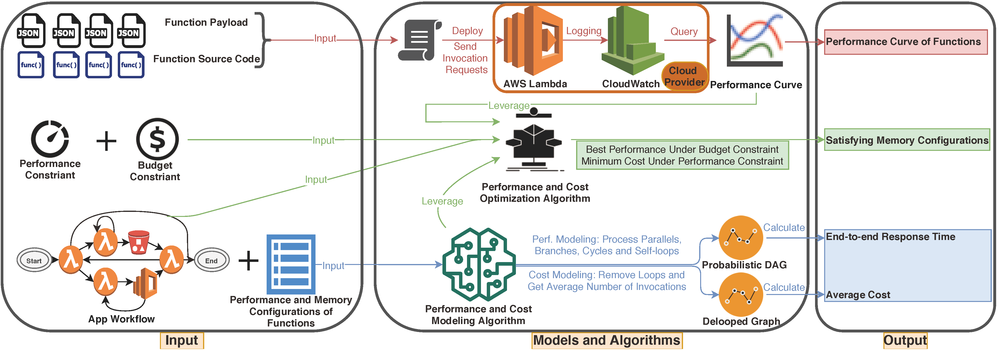
* Two analytical models to accurately get the average end-to-end response time and cost of serverless applications.
* Probability refined critical path algorithm to answer the follwing two optimization problems for non-DAG serverless workflows. 
    * Best performance (end-to-end response time) under a budget constraint
    * Best cost under a performance constraint
* Models and algorithms verified by experiments on AWS.
## Artifacts
* [Performance and Cost Models](./source/ServerlessAppPerfCostMdlOpt/ServerlessAppWorkflow)
* [Probability Refined Critical Path Algorithm](./source/ServerlessAppPerfCostMdlOpt/PerfOpt)
* [Servleress Application Generator for Testing and Experimental Evaluations](./source/ServerlessAppPerfCostMdlOpt/AppGenerator)
* [Scripts and Resulsts of Experimental Evaluations](./evaluations)
    * [Experimental Evaluations of Performance and Cost Models](./evaluations/model)
        * [Result Analysis](./evaluations/model/analysis/ResultAnalysis.ipynb)
        * [App8](./evaluations/model/App8/App8.ipynb)
        * [App10](./evaluations/model/App10/App10.ipynb)
        * [App12](./evaluations/model/App12/App12.ipynb)
        * [App14](./evaluations/model/App14/App14.ipynb)
        * [App16](./evaluations/model/App16/App16.ipynb)
    * [Experimental Evaluations of the Probability Refined Critical Path Algorithm](./evaluations/alg)
        * [Result Analysis](./evaluations/alg/analysis/ResultAnalysis.ipynb)
        * [App1](./evaluations/alg/App1/App1.ipynb)
        * [App2](./evaluations/alg/App2/App2.ipynb)
        * [App3](./evaluations/alg/App3/App3.ipynb)
        * [App4](./evaluations/alg/App4/App4.ipynb)
        * [App5](./evaluations/alg/App5/App5.ipynb)
        * [App6](./evaluations/alg/App6/App6.ipynb)
* [Worst Case Scenario Analysis](./evaluations/model/WorstCaseScenario/WorstCaseScenario.ipynb)
* [AWS Step Functions Interaction Delay Analysis](./evaluations/model/SFNDelay/StepFunctionsDelay.ipynb)

## Requirements
* Python>=3.7
* pip>=19.1.1

Required Python packages are listed in requirements.txt

Installation:
```
pip install -r requirements.txt
```

## Usage
Please follow this [documentation](./docs/usage.ipynb).

## Figures
Hover to see the caption. Self-loop edges might be overlapped.
### Evaluation Results

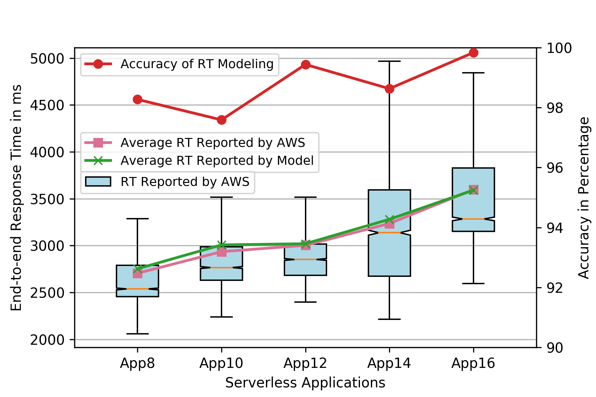
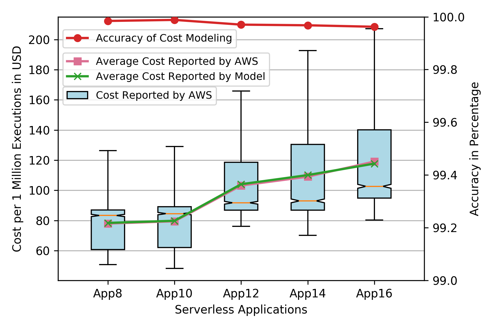


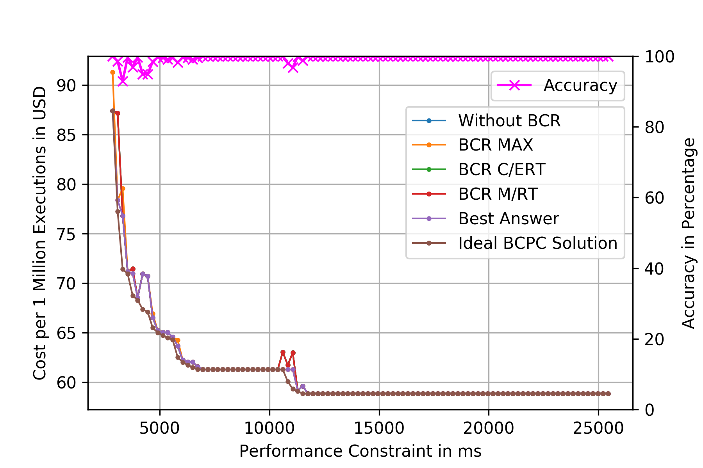


### Workflow of Apps
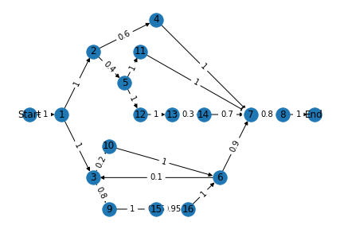
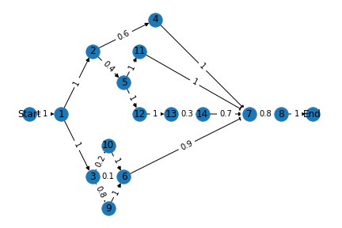

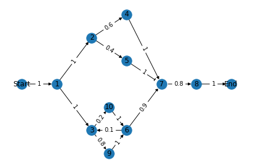
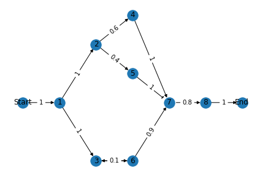
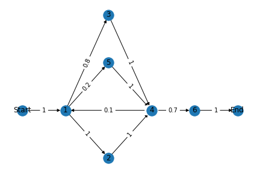
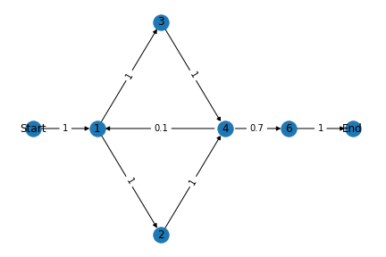
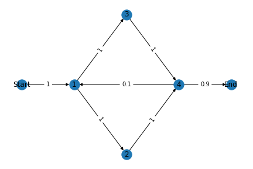
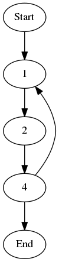
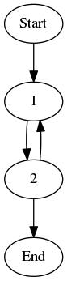
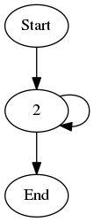


## Abstract of the Paper
Function-as-a-Service (FaaS) and Serverless applications have proliferated significantly in recent years because of their high scalability, ease of resource management, and pay-as-you-go pricing model. However, cloud users are facing practical problems when they shift their applications to serverless pattern, which are the lack of analytical performance and billing model and trade-off between limited budget and Service Level Agreement (SLA) guaranteed performance of serverless applications. In this paper, we fill this gap by proposing and answering two research questions regarding the prediction and optimization of performance and cost of a serverless applications. We propose the definition of the serverless workflow, and implement analytical models to predict the average end-to-end response time and cost of the application, giving practical solutions to the current unpredictable performance and cost problems for serverless applications. We propose a heuristic algorithm named Probability Refined Critical Path Greedy algorithm (PRCP) with four greedy strategies to answer two types of optimization questions regarding performance and cost. We experiment proposed models with five serverless applications deployed on AWS. Our results show that the performance and cost models can predict the performance and cost of serverless applications with more than 97.5\% of accuracy. PRCP can give the optimized memory configurations of functions in serverless applications with over 97\% of accuracy.
